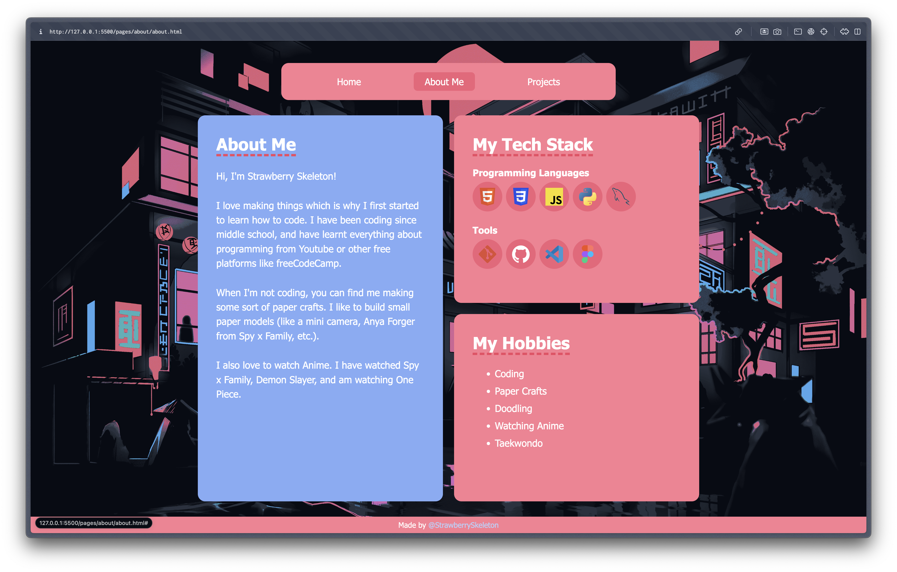

# Simple Personal Website
a very simple personal portfolio website

> it's called simple personal websoite because i wish to make a cool 3d/animated/game type personal websote someday which will not be simple.

## Features
It has three pages:
1. Home Page: an introductory page with my name and a few social links
2. About Page: a page about me with my tech skills and hobbies listed
3. Projects Page: a page contaning some of my previous projects

It has a Pink and Black theme to match my username Strawberry Skeleton (pink for strawberry, and black for skeleton + i love dark mode)

## Project Screenshots

## Credits
- made by me
- Background Image: https://in.pinterest.com/pin/464785624052200507/
- Tech Stack Icons - https://www.tech-stack-icons.com/
- Link Icon - https://www.svgrepo.com/svg/532869/link-alt-1